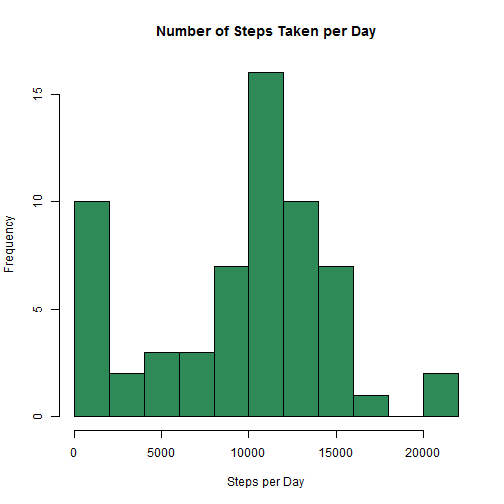
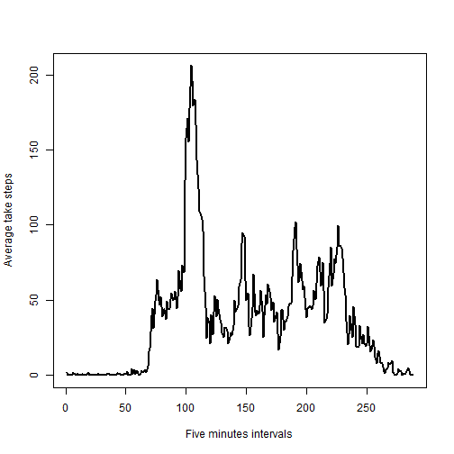
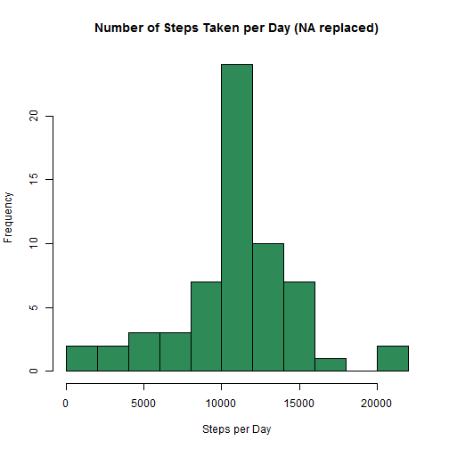
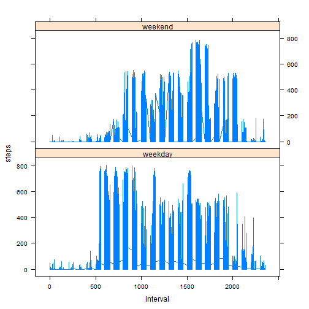

# Reproducible Research: Peer Assessment 1

This work is part of the 1st Peer Assessment for the Reproducible Research Course. The first step in this work is to obtain the data set  [Activity Monitoring Data](https://d396qusza40orc.cloudfront.net/repdata%2Fdata%2Factivity.zip)

## Loading and preprocessing the data

For this part of the assignment the code below does the following:
- Load data in R and define the appropriate classes for each field in the data set
- Obtain  the column names (colNames), number of rows in the data set (numberofRows)
- Print numberofRows and colNames
- Print the time/date the dataset was downloaded from the github

The follwoing ** R ** code just shows the time the the dataset was created/ downloaded 

```r

sourceFile <- "activity.zip"

## show the time the file was downloaded
dateaccessed <- as.character(file.info(sourceFile)$mtime)
cat("activity.zip was downloaded on: ", dateaccessed)
```

```
## activity.zip was downloaded on:  2014-05-18 16:08:14
```


The first step is to load the data set into R, this code will only work if the activity.zip file is available in your working directory. After data is loaded, then column names and the number of records in the data set are printed, just for quick exploration of the data


```r
## extract the activity.csv from the zip file load the file into R and
originalData <- read.csv(unz(sourceFile, "activity.csv"), header = TRUE, colClasses = c("numeric", 
    "Date", "numeric"), stringsAsFactors = FALSE)
## get the column names in the data set
colNames <- colnames(originalData)
# number of rows in the originalData
numberofRows <- nrow(originalData)
## print colNames and numberofRows
cat("Number of Records in the Data Set: ", numberofRows, "\n", "Columns Names in the Data Set:", 
    colNames)
```

```
## Number of Records in the Data Set:  17568 
##  Columns Names in the Data Set: steps date interval
```


## What is mean total number of steps taken per day?

To get the mean, first we construct a subset of data that contains the number of steps per day. First, lets construct the subset, then create the histogram and followed by computing the mean and the median as shown below:

```r
## {plyr} is required before calling the ddply function
require(plyr)
```

```
## Loading required package: plyr
```

```
## Warning: package 'plyr' was built under R version 3.0.3
```

```r
## for this part, remove the missing values. If you work in RStudio you may
## need to replace summarize with summarise if you recieve an error?
dataSubset <- ddply(originalData, .(date), summarize, steps = sum(steps, na.rm = TRUE))
hist(dataSubset$steps, breaks = 15, main = "Number of Steps Taken per Day", 
    col = "seagreen", xlab = "Steps per Day", ylab = "Frequency")
```

 

To calculate the mean and median, the dataSubset will be used. 

```r
meanVal <- mean(dataSubset$steps)
medVal <- median(dataSubset$steps)
## show the results
cat("Mean value of steps taken per day is: ", meanVal, "\nMedian value of steps taken per day is: ", 
    medVal)
```

```
## Mean value of steps taken per day is:  9354 
## Median value of steps taken per day is:  10395
```

## What is the average daily activity pattern?

- To make the time seriese, we need to take the average number of steps accross all available intervals
- This requires creating a subset grouped by interval as follows: 

```r
## create a subset i.e. dataframe of average number of steps grouped by
## interval overall there is 288 interval (i.e. nrow(dataSubset) results in
## 288)
dataSubset <- ddply(originalData, .(interval), summarize, average_steps = mean(steps, 
    na.rm = TRUE))

## plot a time series of average number of taken steps per interval
plot(1:288, dataSubset$average_steps, type = "l", lwd = 2, xlab = "Five minutes intervals", 
    ylab = "Average take steps")
```

 


The code below reports which 5-minute interval, on average across all the days in the dataset,
contains the maximum number of steps:


```r
maxInterval <- dataSubset[which.max(dataSubset[, "average_steps"]), ]
## print the results
cat("The Interval ", maxInterval$interval, " On average accross all days, \n    has the maximum number of steps which is equal to", 
    maxInterval$average_steps)
```

```
## The Interval  835  On average accross all days, 
##     has the maximum number of steps which is equal to 206.2
```

## Imputing missing values


1 The the total number of rows with missing values *NAs* is obtained as follows 

```r
nRowsMissing <- nrow(originalData[!complete.cases(originalData), ])
```

To report the results to the user, the follwoing code is needed 

```r
cat("Total Number of Rows with NA's is ", nRowsMissing)
```

```
## Total Number of Rows with NA's is  2304
```

2 The strategy for filling the missing values is simple, each missing value will be replaced with the average steps taken in that day. There is wide range of methods for dealing with missing values, have a look at [stackoverflow](http://stackoverflow.com) for [Some Interesting Posts](http://stackoverflow.com/questions/20273070/function-to-impute-missing-value) on this issue. Another very useful package to deal with missing values is [Amelia Package](http://cran.r-project.org/web/packages/Amelia/vignettes/amelia.pdf)

```r
require(plyr)
## We need to remove the NA initially to get an approximated averages for the
## time intervals
proccessedDataSet <- ddply(originalData, .(interval), summarize, average_steps = mean(steps, 
    na.rm = TRUE))
```

This will give us a data frame with all time intervals and the average number of steps taken at each interval. This date will be used to fill missing values. Executing the command:  
**head**  *(proccessedDataSet,10)*, will show how this dataframe  looks like

```
##    interval average_steps
## 1         0       1.71698
## 2         5       0.33962
## 3        10       0.13208
## 4        15       0.15094
## 5        20       0.07547
## 6        25       2.09434
## 7        30       0.52830
## 8        35       0.86792
## 9        40       0.00000
## 10       45       1.47170
```


Next step, is to find all missing values in the original dataset and replace them with the average steps taken in the corresponding interval in the *proccessedDataSet* dataset. The follwoing code make use ['DataCombine'](http://cran.r-project.org/web/packages/DataCombine/DataCombine.pdf) package 

*FillIn*  function is used for filling in missing values of steps in the original data set from the processed data set which contains averaged intervals of steps. Results are stored in filledDataSet


```r
require(DataCombine)
```

```
## Loading required package: DataCombine
```

```
## Warning: package 'DataCombine' was built under R version 3.0.3
```

```r
filledDataSet <- FillIn(originalData, proccessedDataSet, "steps", "average_steps", 
    "interval")
```

```
## 2304 NAs were replaced.
```


3 The new data set of filled data (**filledDataSet**)is already created, and here is the histogram for the new data set, followed by the mean and median values 


```r

dataSubset <- ddply(filledDataSet, .(date), summarize, steps = sum(steps))
hist(dataSubset$steps, breaks = 15, main = "Number of Steps Taken per Day (NA replaced)", 
    col = "seagreen", xlab = "Steps per Day", ylab = "Frequency")
```

 

The mean and median values for the filled data set are calculated here

```r
meanValF <- mean(filledDataSet$steps)
medValF <- median(filledDataSet$steps)
## show the results
cat("Mean value of steps taken per day is (with NA's replaced): ", meanValF, 
    "\nMedian value of steps taken per day is: ", medValF)
```

```
## Mean value of steps taken per day is (with NA's replaced):  37.38 
## Median value of steps taken per day is:  0
```

The results above shows clearly that imputing missing data will change the average number of steps taken as well as the median value. The average number of steps taken per day is significantly reduced
## Are there differences in activity patterns between weekdays and weekends?

We first need to update the filledDataSet data set to include another column and we will cal it weekDays. This will take values of (sun, mon, ....sat), 

```r
## Add a new column to the filled dataset and set it to equal the day value
filledDataSet$weekDays <- weekdays(filledDataSet$date)
## Add a nother column which will indicate wheather this day is weekday or
## weekend
filledDataSet[((filledDataSet[, 4] == "Saturday") | (filledDataSet[, 4] == "Sunday")), 
    5] <- "weekend"
filledDataSet[!((filledDataSet[, 4] == "Saturday") | (filledDataSet[, 4] == 
    "Sunday")), 5] <- "weekday"

## drop the fourth column because it is not needed any more
filledDataSet$weekDays = NULL

## change the column name
colnames(filledDataSet)[4] <- "weekdays"

## Check the results and see how the data set looks like
head(filledDataSet, 10)
```

```
##    interval  steps       date weekdays
## 1         0  1.717 2012-10-01  weekday
## 2         0  0.000 2012-10-02  weekday
## 3         0  0.000 2012-10-03  weekday
## 4         0 47.000 2012-10-04  weekday
## 5         0  0.000 2012-10-05  weekday
## 6         0  0.000 2012-10-06  weekend
## 7         0  0.000 2012-10-07  weekend
## 8         0  1.717 2012-10-08  weekday
## 9         0  0.000 2012-10-09  weekday
## 10        0 34.000 2012-10-10  weekday
```

Now the day set has another two columns, so we can plot activity based on weekdays or weekends time as required. 


```r

## first subset the data to include only weekends, and show the first few
## records for testing
weekEndsSubset <- subset(filledDataSet, filledDataSet$weekdays == "weekend")
## similarly subset the data to include only weekdays, and show the first few
## records for testing
weekDaysSubset <- subset(filledDataSet, filledDataSet$weekdays == "weekday")
```

Now, the next step before plotting the time series is to averag the two data sets:
* *weekDaysSubset*
* *weekEndsSubset*


```r

## Average subsets accross intervals
weekEndsAveraged <- ddply(weekEndsSubset, .(interval), summarize, average_steps = mean(steps))
head(weekEndsAveraged)
```

```
##   interval average_steps
## 1        0      0.214623
## 2        5      0.042453
## 3       10      0.016509
## 4       15      0.018868
## 5       20      0.009434
## 6       25      3.511792
```

```r
weekDayssAveraged <- ddply(weekDaysSubset, .(interval), summarize, average_steps = mean(steps))
head(weekDayssAveraged)
```

```
##   interval average_steps
## 1        0       2.25115
## 2        5       0.44528
## 3       10       0.17317
## 4       15       0.19790
## 5       20       0.09895
## 6       25       1.59036
```

```r


## load lattice library
require(lattice)
```

```
## Loading required package: lattice
```

```
## Warning: package 'lattice' was built under R version 3.0.3
```

```r

xyplot(steps ~ interval | weekdays, data = filledDataSet, type = "l", layout = c(1, 
    2))
```

 

