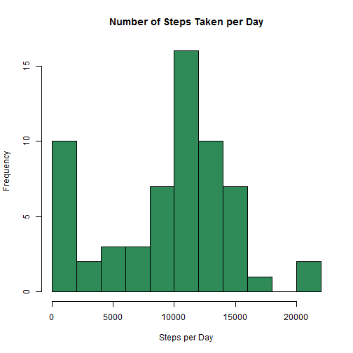
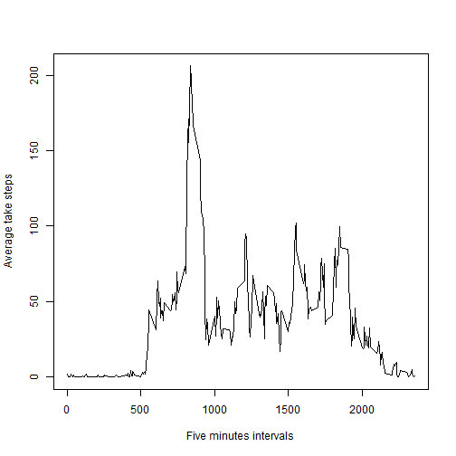

# Reproducible Research: Peer Assessment 1

This work is part of the 1st Peer Assessment for the Reproducible Research Course. The first step in this work is to obtain the data set whic his available here [link](https://d396qusza40orc.cloudfront.net/repdata%2Fdata%2Factivity.zip)

## Loading and preprocessing the data

For this part of the assignment the code below does the following:
- Unzip the zipped file
- Load data in R and define the appropriate classes for each field in the data set
- Obtain  the column names (colNames), number of rows in the data set (numberofRows)
- Print numberofRows and colNames
- Print the time/date the dataset was downloaded from the github


```r

sourceFile <- "activity.zip"

## show the time the file was downloaded
dateaccessed <- as.character(file.info(sourceFile)$mtime)
cat("activity.zip was downloaded on: ", dateaccessed)
```

```
## activity.zip was downloaded on:  2014-05-17 02:02:19
```

```r

## load the file into R and extract the activity.csv from the zip file
dataSet <- read.csv(unz(sourceFile, "activity.csv"), header = TRUE, colClasses = c("numeric", 
    "Date", "numeric"), stringsAsFactors = FALSE)
## get the column names in the data set
colNames <- colnames(dataSet)
# number of rows in the dataset
numberofRows <- nrow(dataSet)
## print colNames and numberofRows
cat("Number of Records in the Data Set: ", numberofRows, "\n", "Columns Names in the Data Set:", 
    colNames)
```

```
## Number of Records in the Data Set:  17568 
##  Columns Names in the Data Set: steps date interval
```


## What is mean total number of steps taken per day?

To get the mean, first we construct a subset of data that contains the number of steps per date:

```r
## {plyr} is required before calling the ddply function
require(plyr)
## for this part, remove the missing values
dataSubset <- ddply(dataSet, .(date), summarize, steps = sum(steps, na.rm = TRUE))
hist(dataSubset$steps, breaks = 15, main = "Number of Steps Taken per Day", 
    col = "seagreen", xlab = "Steps per Day", ylab = "Frequency")
```

 

To calculate the mean and median, the dataSubset will be used. 

```r
meanVal <- mean(dataSubset$steps)
medVal <- median(dataSubset$steps)
## show the results
cat("Mean value of steps taken per day is: ", meanVal, "\nMedian value of steps taken per day is: ", 
    medVal)
```

```
## Mean value of steps taken per day is:  9354 
## Median value of steps taken per day is:  10395
```

## What is the average daily activity pattern?

- To make the time seriese, we need to take the average number of steps accross all available intervals
- This requires creating a subset grouped by interval as follows: 

```r
## create a subset i.e. dataframe of average number of steps grouped by
## interval overall there is 288 interval (i.e. nrow(dataSubset) results in
## 288)
dataSubset <- ddply(dataSet, .(interval), summarize, steps = mean(steps, na.rm = TRUE))

## plot a time series of average number of taken steps per activity
plot(dataSubset$interval, dataSubset$steps, type = "l", xlab = "Five minutes intervals", 
    ylab = "Average take steps")
```

 


The code below reports which 5-minute interval, on average across all the days in the dataset,
contains the maximum number of steps:


```r
maxInterval <- dataSubset[which.max(dataSubset[, "steps"]), ]
## print the results
cat("The Interval ", maxInterval$interval, " On average accross all days, has the maximum number of steps which is equal to", 
    maxInterval$steps)
```

```
## The Interval  835  On average accross all days, has the maximum number of steps which is equal to 206.2
```

## Imputing missing values


## Are there differences in activity patterns between weekdays and weekends?
